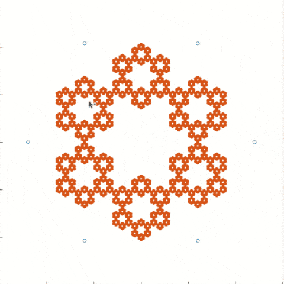

## Bu dizin içerisinde yer alan kodlamalar ve açıklamaları

# Poligondaki rastgele bir noktadan gelen düzen [t1.m]
Twitter üzerinde gördüğüm bir paylaşıma istinaden MATLAB üzerinde t1.m dosyasını oluşturup sonuçları incelediğimizde aşağıdaki görüntü bizleri karşılıyor :)

<blockquote class="twitter-tweet">
a simple and random process that creates an intricate and structured fractal pattern. At each step, pick a random edge to form a triangle, and the next point is the center of the triangle. <a href="https://t.co/yLxmdZQCWY">pic.twitter.com/yLxmdZQCWY</a>
&mdash; Matt Henderson (@matthen2) <a href="https://twitter.com/matthen2/status/1268808515574886407?ref_src=twsrc%5Etfw">June 5, 2020</a></blockquote>

Bu örnek eşkanar altıgen için 100 bin adet rastgele nokta seçilerek üretilmiştir.

Kodlama üzerinden poligonun köşe sayısını değiştirdiğinizde benzer şekilde iç içe kopya görüntülerin oluştuğunu görebilirsiniz. Gerçekten ilginç :)

Bir sonraki sefere bu olayın matematiksel altyapısını irdeleyelim mi ne dersiniz?
